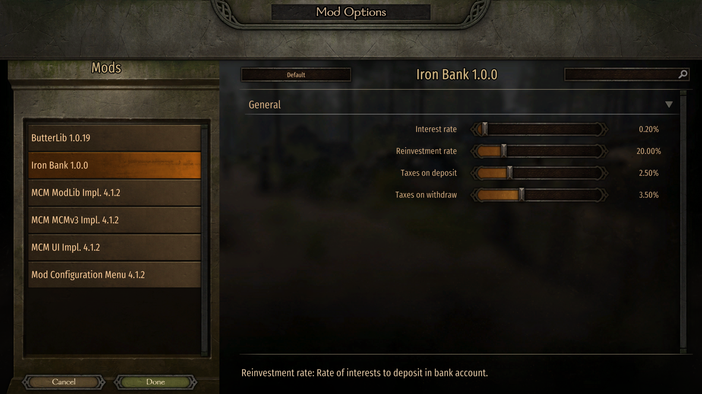
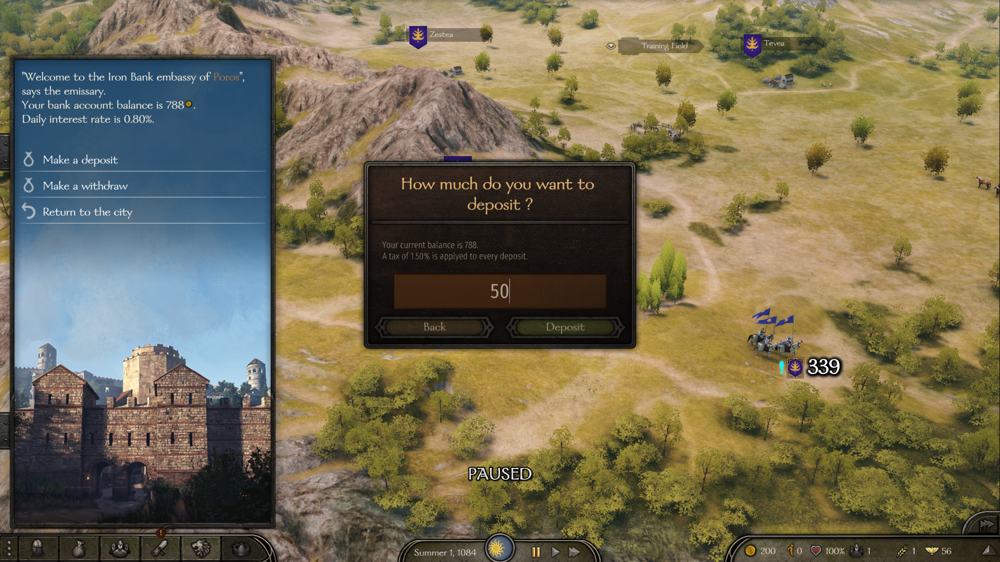
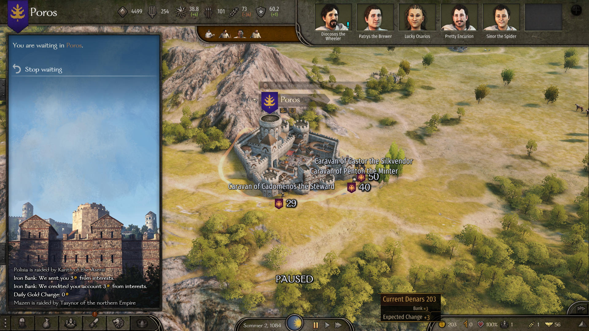

<h1 align="center">
	
	<br>
</h1>

# Iron Bank

A very basic banking system for Mount and Blade: Bannerlord, and my first mod ever.

## Features

- Global player bank account, accessible from every city.
- Gold deposit (with taxes)
- Gold withdraw (with taxes)
- Daily interests generation.
- Choose where your interests are deposited (your purse or your bank account).
- Configurable settings using [MCM](https://www.nexusmods.com/mountandblade2bannerlord/mods/612) (optional).

## Todo

- [x] Loans, affected by renown (high renown means high loan capacity, more wars means higher cost)
- [x] Overdraft, affecting by renown (a negative bank balance lowers your renown proportionally)
- [ ] Dynamic interests rate, affected by world stability (more wars means higher interest rates)
- [x] Move reinvestment option from MCM to ingame bank menu
- [x] Update release script to name the zip with the SubModule version
- [ ] Add save game compatibility infos in README
- [ ] Support Localization
- [ ] Learn about the new GUI system, should we use it ?
- [ ] Publish on [nexus](https://www.nexusmods.com/mountandblade2bannerlord)

## Development

### Prerequisites

- Mount and Blade II: Bannerlord
	- (optional) With [MCM mod](https://www.nexusmods.com/mountandblade2bannerlord/mods/612)
		- And its dependencies [ButterLib mod](https://www.nexusmods.com/mountandblade2bannerlord/mods/2018)
		- And its dependencies [Harmony](https://www.nexusmods.com/mountandblade2bannerlord/mods/2006)
		- And its dependencies [UIExtenderEx mod](https://www.nexusmods.com/mountandblade2bannerlord/mods/2102)
- Visual Studio
- Powershell (building script)

### Getting started

Clone or fork the repository:

```
git clone git@github.com:BlitzBanana/Bannerlord.IronBank.git %BANNERLORD_DIRECTORY%\Modules\IronBank
```

Configure debug settings using your Bannerlord path like it's explained [here](https://docs.bannerlordmodding.com/_tutorials/basic-csharp-mod.html#preparation).

- In Visual Studio go to IronBank > Properties > Debug
- Configuration: All Configurations
- Start Action: Start external Program: `%BANNERLORD_DIRECTORY%\bin\Win64_Shipping_Client\Bannerlord.exe`
- Start Options: Command line arguments:
```
/singleplayer _MODULES_*Bannerlord.Harmony*Bannerlord.ButterLib*Bannerlord.UIExtenderEx*Bannerlord.MBOptionScreen*Bannerlord.MBOptionScreen.MCMv3*Bannerlord.MBOptionScreen.ModLib*Native*SandBoxCore*CustomBattle*SandBox*StoryMode*IronBank*_MODULES_
```
- Start Options: Working directory: `%BANNERLORD_DIRECTORY%\bin\Win64_Shipping_Client\`

### Debugging

When you starts a debug session, it runs the game with the mod and its dependencies.

### Releasing

Just run `release.ps1` powershell script.  
It will generate a zip ready to ne renamed with the version.

## Screenshots

<p align="center">
	
</p>

<p align="center">
	
</p>

<p align="center">
	
</p>
